# Photocard Marketplace & Personal Gallery

A frontend-focused web application that simulates a **photocard marketplace** combined with a **personal gallery** feature inspired by Pinterest-style layouts.

---

## 🌟 Features

### 🛒 Photocard Marketplace
- Browse photocard products
- View product details
- Add products to cart
- Create and manage orders
- Wishlist and personal collection management

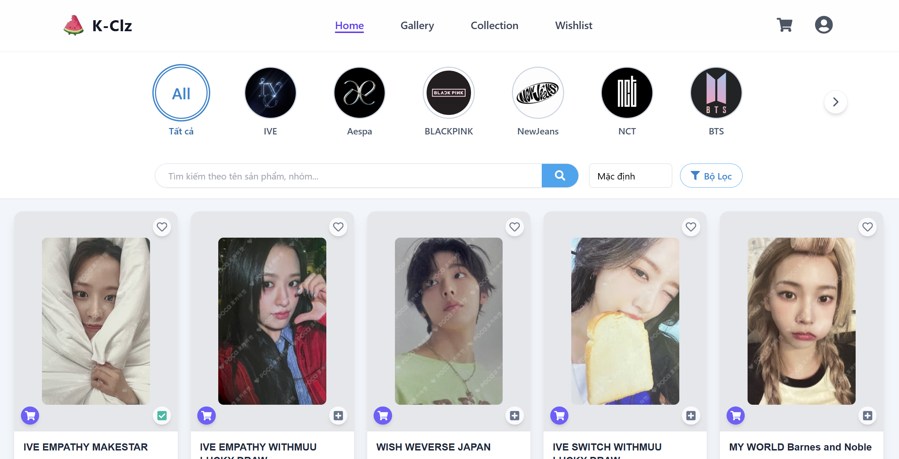
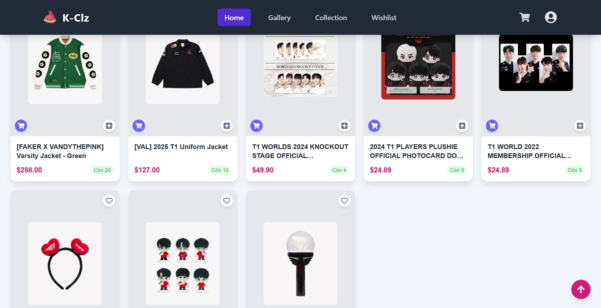

---

### 🛍️ Cart & Order Flow
- Add and remove items from cart
- Update product quantity
- Create and save orders
- View order history

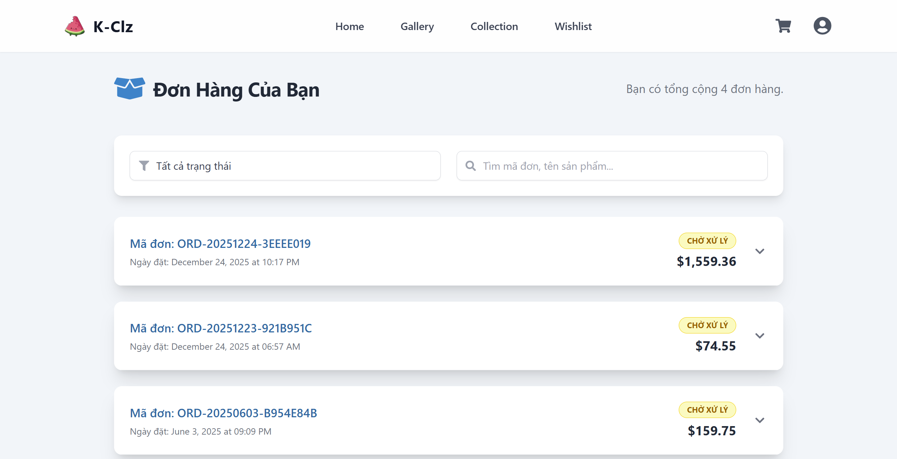
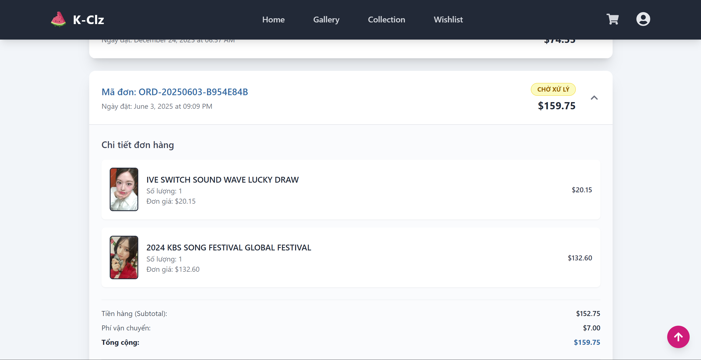

---

### ❤️ Wishlist & Collection
- Save favorite photocards
- Manage personal collections
- Quick access to saved items

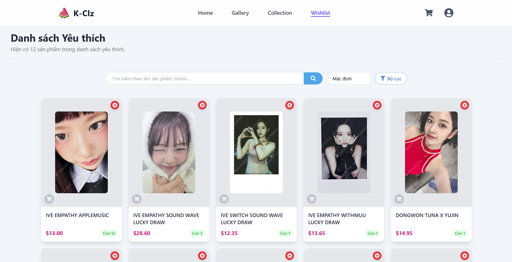
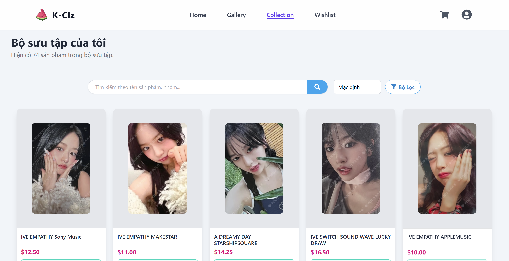

---

### 🖼️ Personal Gallery
- Upload images or save image URLs
- Display images in a Pinterest-style masonry layout
- Personal gallery for each authenticated user

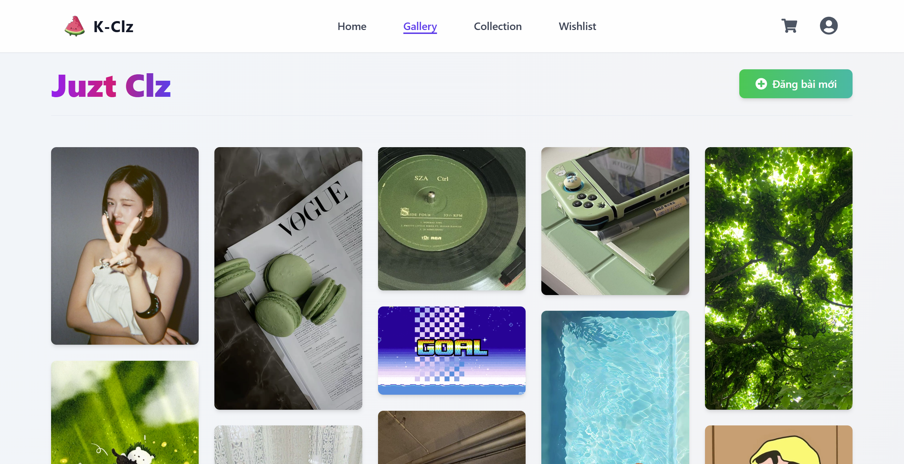
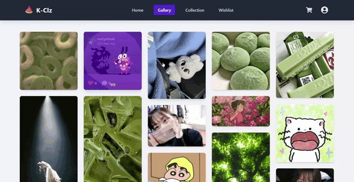

---

### 🔐 Authentication
- User registration and login
- JWT-based authentication
- Secure access to user-specific features

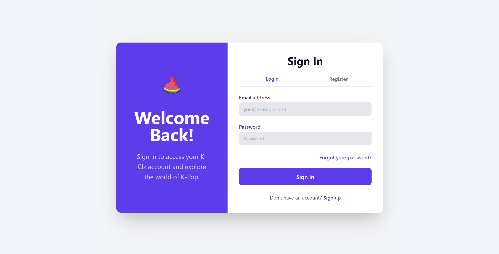
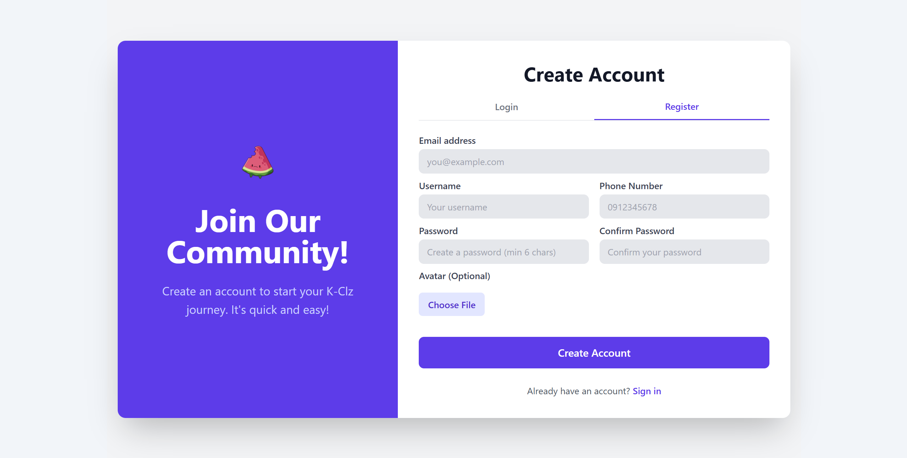
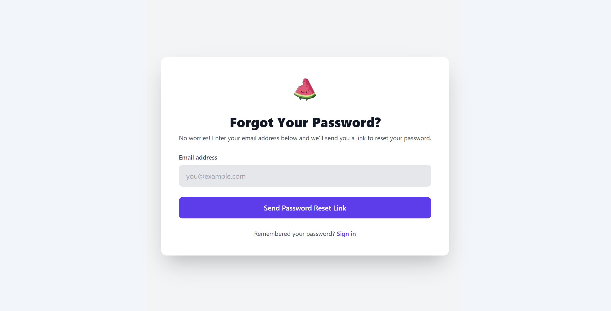

---

## 🛠️ Technologies Used

### Frontend
- **ReactJS**
- **Tailwind CSS**
- HTML5, CSS3, JavaScript
- RESTful API integration

### Backend
- **Java (Spring Boot)**
- RESTful APIs
- JWT-based authentication

### Database
- **MySQL**

---

## 🎯 Project Purpose

This project was built as a **personal learning project** to:
- Improve frontend development skills with React and Tailwind CSS
- Practice building real-world UI features (cart, wishlist, gallery)
- Explore Pinterest-style layouts and responsive UI design
- Gain experience integrating frontend with backend RESTful APIs
